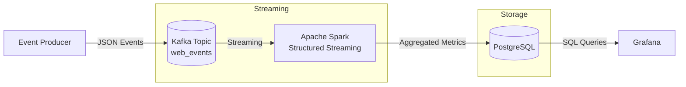

# Real-Time Traffic Analytics Pipeline
## Overview

This project implements a real-time data pipeline for ingesting, processing, and aggregating web traffic events using Apache Kafka, Apache Spark Structured Streaming, and PostgreSQL.
The pipeline computes time-windowed traffic metrics and stores them for querying and visualization.

All services run locally using Docker Compose.

# Architecture



# Data Flow

Event producer publishes JSON events to Kafka topic web_events

Spark Structured Streaming reads events from Kafka

Events are parsed, validated, and converted to event-time

Windowed aggregations are applied with watermarking

Aggregated results are written to PostgreSQL

PostgreSQL serves data for analytical queries or dashboards

# Project Structure
```
realtime-traffic-pipeline/
│
├── docker-compose.yml
│
├── api/
│   ├── Dockerfile
│   ├── requirements.txt
│   └── main.py
│
├── spark/
│   ├── Dockerfile
│   └── streaming_job.py
│
├── producer/
│   └── event_generator.js
│
├── db/
│   └── schema.sql
│
└── README.md


```

# Running the Project
## Start all services
```
docker-compose up --build
```

## Run the Producer
```
cd producer
node event_generator.js
```
## Stopping the pipeline
```
docker-compose down -v
```

# Troubleshooting
| Issue                     | Check                                 |
| ------------------------- | ------------------------------------- |
| No data in PostgreSQL     | Verify Spark logs and checkpoint path |
| Kafka connection errors   | Verify `advertised.listeners`         |
| Spark restarts repeatedly | Check memory availability             |
| JDBC write failures       | Verify schema and JDBC driver         |
